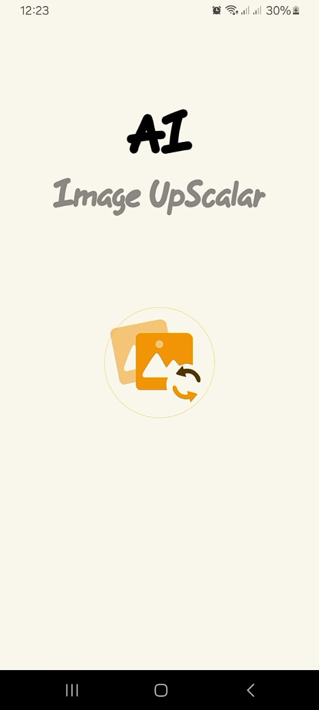
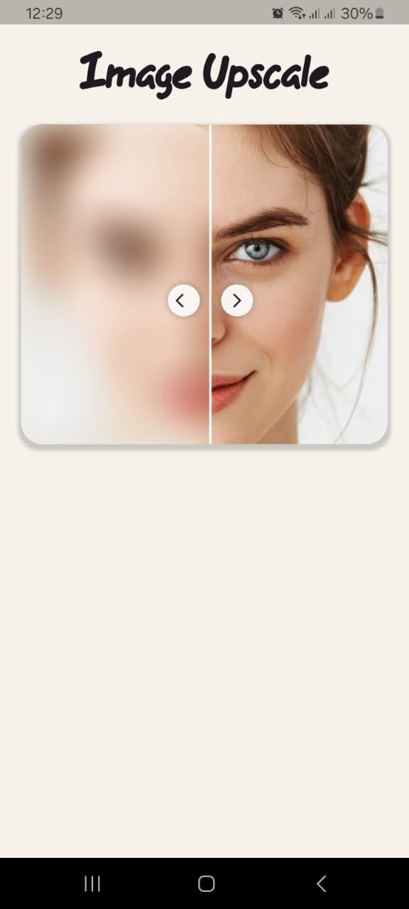
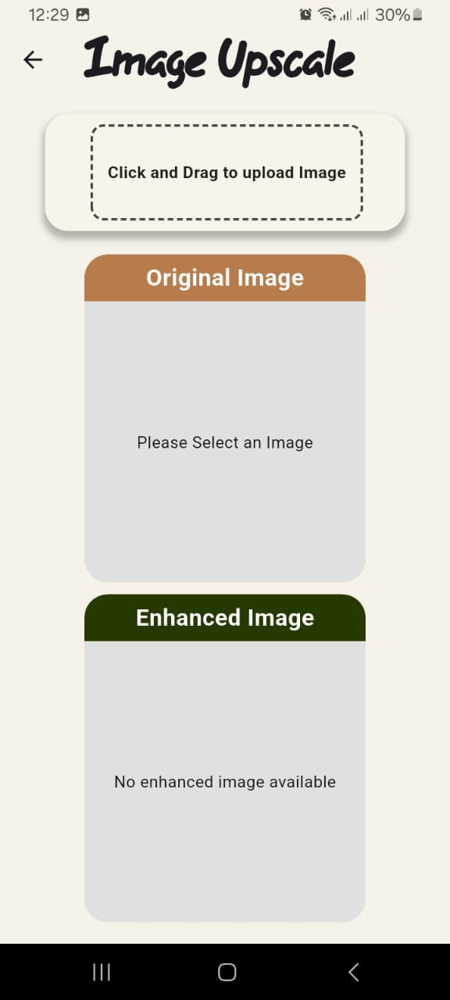

# AI Image Upscaler 🚀

A powerful Flutter application that uses AI technology to enhance and upscale images with just one tap. Transform your low-resolution images into high-quality, crisp visuals using advanced AI algorithms.

## 📱 Screenshots

### App Interface & Demo
| Splash Screen | Home Screen | Main Screen |
|:---:|:---:|:---:|
|  |  |  |

### App Demo Video
<p align="center">
  <video width="300" controls>
    <source src="assets/Final_UI/image_upscalar_app.mp4" type="video/mp4">
    Your browser does not support the video tag.
  </video>
</p>

*Note: If the video doesn't play in your browser, you can download it directly from the assets folder.*

## ✨ Features

- 🖼️ **One-Tap Enhancement**: Upload and enhance images with a single tap
- 🤖 **AI-Powered**: Uses advanced AI algorithms for image upscaling
- 📱 **Beautiful UI**: Modern, intuitive interface with smooth animations
- 💾 **Easy Download**: Save enhanced images directly to your gallery
- 🎯 **4x Scale**: Upscale images up to 4x their original resolution
- 🔄 **Real-time Processing**: Track enhancement progress with loading animations
- 📸 **Gallery Integration**: Pick images directly from your device gallery
- 🎨 **Interactive Demo**: Drag-to-reveal image quality comparison on home screen

## 🛠️ Technologies Used

- **Flutter**: Cross-platform mobile development framework
- **Provider**: State management solution
- **HTTP/Dio**: API communication and file downloading
- **Image Gallery Saver**: Save images to device gallery
- **Permission Handler**: Manage device permissions
- **Liquid Swipe**: Smooth onboarding experience
- **Lottie**: Beautiful loading animations
- **Image Picker**: Gallery image selection

## 📋 Prerequisites

Before running this project, make sure you have:

- Flutter SDK (>=3.0.0)
- Dart SDK (>=3.0.0)
- Android Studio or VS Code
- A valid API key for the image enhancement service

## 🚀 Getting Started

### 1. Clone the Repository
```bash
git clone https://github.com/saqibcheema/ai-image-upscaler.git
cd ai-image-upscaler
```

### 2. Install Dependencies
```bash
flutter pub get
```

### 3. Configure API Key
1. Open `lib/Utils/utilities.dart`
2. Replace the API key with your own:
```dart
String _ApiKey = 'your_api_key_here';
```

### 4. Run the App
```bash
flutter run
```

## 📁 Project Structure

```
lib/
├── Logic/
│   ├── download_image_request.dart    # Image download functionality
│   └── image_enhancer_provider.dart   # Main app state management
├── Pages/
│   ├── home.dart                      # Home screen with demo
│   ├── main_page.dart                 # Main enhancement interface
│   ├── onboarding_screen.dart         # App introduction
│   └── splash_screen.dart             # Loading screen
├── Utils/
│   └── utilities.dart                 # API configuration
├── Widgets/
│   ├── enhanced_image_widget.dart     # Enhanced image display
│   ├── image_picker_widget.dart       # Image selection widget
│   ├── original_image_widget.dart     # Original image display
│   └── SnackBarWidget.dart           # Notification messages
└── main.dart                          # App entry point
```

## 🔧 Key Components

### ImagePickerProvider
The main state management class that handles:
- Image selection from gallery
- API communication for image enhancement
- Loading states and error handling
- Enhanced image URL management

### DownloadEnhancedImage
Handles the image download process:
- Permission management for Android versions
- Temporary file creation and cleanup
- Gallery saving functionality

### Interactive Home Screen
Features a unique drag-to-reveal demo that showcases the difference between original and enhanced images.

## 🎯 API Integration

The app integrates with an AI image enhancement API:

```dart
// Base URL for the enhancement service
var baseUrl = 'https://techhk.aoscdn.com/api/tasks/visual/scale';

// API workflow:
// 1. POST image with scale parameter
// 2. Receive task ID
// 3. Poll for completion
// 4. Download enhanced image
```

## 📱 Permissions

The app requires the following permissions:

### Android
- `READ_EXTERNAL_STORAGE` (for Android < 13)
- `WRITE_EXTERNAL_STORAGE` (for Android < 13)
- `READ_MEDIA_IMAGES` (for Android >= 13)

These are automatically handled by the app based on the Android version.

## 🎨 Design Features

- **Color Scheme**: Warm, earthy tones with professional aesthetics
- **Typography**: Custom 'Dareo' font family for headings
- **Animations**: Lottie animations for engaging user experience
- **Responsive**: Adapts to different screen sizes
- **Material Design**: Follows Flutter's material design principles

## 🔄 App Flow

1. **Splash Screen**: Welcome animation with app branding
2. **Onboarding**: Introduction to app features
3. **Home Screen**: Interactive demo with drag-to-reveal
4. **Main Interface**: Image selection, enhancement, and download
5. **Gallery Integration**: Seamless image saving

## 🐛 Troubleshooting

### Common Issues

**API Connection Error:**
- Verify your API key is correct
- Check internet connection
- Ensure the API endpoint is accessible

**Permission Denied:**
- Enable storage permissions in device settings
- Restart the app after granting permissions

**Image Not Saving:**
- Check available storage space
- Verify gallery app is functioning

## 📄 License

This project is licensed under the MIT License - see the [LICENSE](LICENSE) file for details.

## 🤝 Contributing

1. Fork the repository
2. Create your feature branch (`git checkout -b feature/amazing-feature`)
3. Commit your changes (`git commit -m 'Add some amazing feature'`)
4. Push to the branch (`git push origin feature/amazing-feature`)
5. Open a Pull Request

## 📞 Support

For support and questions:
- Create an issue in this repository
- Contact: [saqibyu961@gmail.com]

## 🙏 Acknowledgments

- Thanks to the Flutter team for the amazing framework
- AI enhancement API provider for the powerful image processing
- Lottie team for beautiful animations
- All open-source contributors whose packages made this app possible

---

**Made with ❤️ using Flutter**

*Transform your images with the power of AI - One tap, infinite possibilities!*
